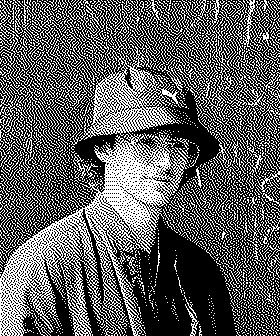

# ascii2img v0.1
A small Python program to convert 6- and 8-bit braille ASCII Art to Black/White Pixel art


 

## Overview

`ascii2img` is a simple Python program that converts ASCII art into pixel art images. The program takes input from a text file (`ascii.txt`) containing ASCII art and generates an output image (`pixel_art.jpg`). The conversion is done by mapping ASCII characters to pixel matrices.

## Installation

1. Clone the repository:

   ```bash
   git clone https://github.com/Tinlia/ascii2img.git
   cd ascii2img
   ```
2. Install `pillow`
   ```bash
   pip install pillow
   ```

## Usage

1. Edit the ascii.txt file to include your braille ASCII art.

2. Run the conversion script:

```bash
python convert.py
```

3. Check the output image in pixel_art.jpg.

## ASCII Mapping
The program maps ASCII characters to pixel matrices in the `colorMatrices` dictionary. You can customize this dictionary to add more characters or modify existing mappings.

This program currently ignores any whitespace in the `ascii.txt` file, so it is suggested that every whitespace be replaced by the character `⠈`. This will be patched next

## Efficiency
Efficiency for the three different examples [ascii.txt](./ascii.txt) (13,500 characters), [ascii2.txt](./ascii2.txt) (37,500 characters), and [ascii3.txt](./ascii3.txt) (150,000 characters) can be found in [the version efficiencies](./versionefficiencies.txt)

## Credits
Braille ASCII art generated using [Lachlan's Braille ASCII Generator](https://lachlanarthur.github.io/Braille-ASCII-Art/)
